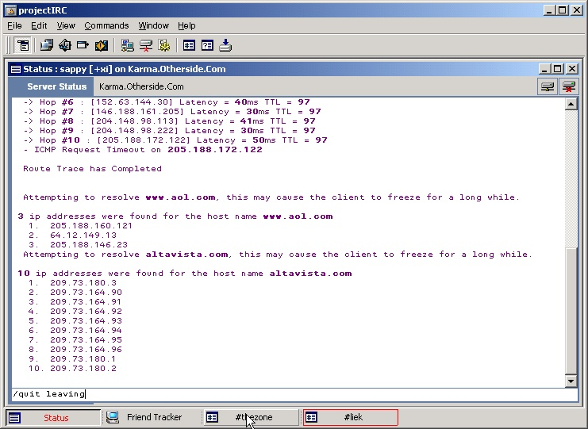



## projectIRC 1\.074 update

### Description

Update of my IRC client.

Added TraceRT and DNS aliases.

Tweaked and new interface (new buttons).

Calculates lag time when joining channels

Fixed many little bugs.

Check www.projectIRC.com for more info on the updates.
 
### More Info
 

             |
---                |---
**Submitted On**   |2001-01-13 10:43:36
**By**             |[vcv](https://github.com/Planet-Source-Code/PSCIndex/blob/master/ByAuthor/vcv.md)
**Level**          |Advanced
**User Rating**    |4.5 (18 globes from 4 users)
**Compatibility**  |VB 6\.0
**Category**       |[Complete Applications](https://github.com/Planet-Source-Code/PSCIndex/blob/master/ByCategory/complete-applications__1-27.md)
**World**          |[Visual Basic](https://github.com/Planet-Source-Code/PSCIndex/blob/master/ByWorld/visual-basic.md)
**Archive File**   |[CODE\_UPLOAD137391132001\.zip](https://github.com/Planet-Source-Code/vcv-projectirc-1-074-update__1-14400/archive/master.zip)

